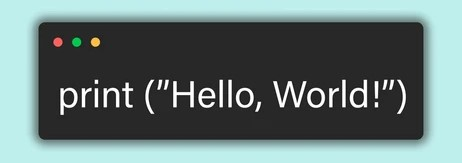

<h1 align="center">Hi, I'm Jophy Mary Mathew! 👋</h1>

  

  
  <strong>MCA Graduate | Python | Django | SQL | Web Development | Machine Learning</strong>

---

### 🛠 About Me
- 🔭 I’m currently looking for job opportunities in Software Development & Data Science.
- 🌱 I’m constantly learning new technologies and improving my skills.
- 💡 Passionate about coding, problem-solving, and exploring new technologies.
- 💬 Ask me about Python, Django, SQL, or Machine Learning!
- 📫 Reach me at **jophymathew17@gmail.com**

  

---

### 🚀 Skills & Technologies

  
  
  
  
  

  

---

### 📌 GitHub Stats

  
  

  

---

### 🔥 My Contributions

  

---

### 🌍 Connect with Me

  
  
  

---

  

⚡ Keep Learning & Keep Coding! 🚀

